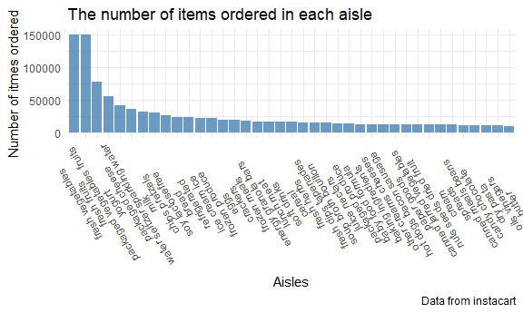
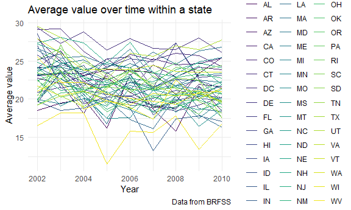
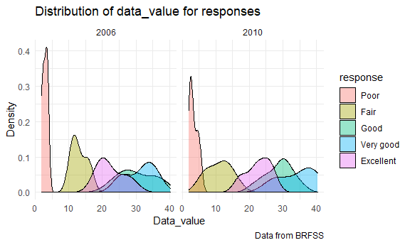
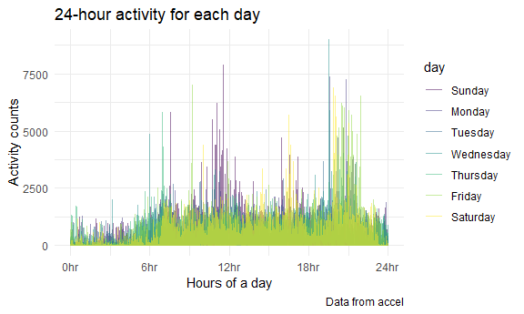

p8105_hw3_xz2981
================
Xinyan Zhou
2021/10/17

``` r
library(tidyverse)
library(readxl)
library(p8105.datasets)
data("instacart")
data("brfss_smart2010")

knitr::opts_chunk$set(
  fig.width = 6,
  fig.asp = .6,
  out.width = "90%"
)

Sys.setlocale("LC_ALL", "English")
```

    ## [1] "LC_COLLATE=English_United States.1252;LC_CTYPE=English_United States.1252;LC_MONETARY=English_United States.1252;LC_NUMERIC=C;LC_TIME=English_United States.1252"

# Problem 1

## Data description

The dataset contains observations on 1384617 orders from Instacart, an
online grocery service. The data include 15 variables.

Some variables provide descriptive information like identification and
name: e.g., order_id (order identifier), product_id (product
identifier), product_name (name of the product), aisle_id (aisle
identifier), aisle (the name of the aisle).

Some variables provide information for customer behavior analysis:
add_to_cart_order (order in which each product was added to cart),
order_dow (the day of the week on which the order was placed),
order_hour_of_day (the hour of the day on which the order was placed),
days_since_prior_order (days since the last order, capped at 30, NA if
order_number=1).

An example describing observation 1:  
The order (order_id = 1) from customer (user_id = 112108) includes a
product named “Bulgarian Yogurt”, which is from aisle of yogurt and
department of dairy eggs. This order happened at 10 am, Thursday. This
product has been ordered by this user in the past, and days since the
last order are 9. The order in which this product was added to cart is
1.

## Questions and answers

### Q1

``` r
instacart %>%
  count(aisle, sort = TRUE) 
```

    ## # A tibble: 134 x 2
    ##    aisle                              n
    ##    <chr>                          <int>
    ##  1 fresh vegetables              150609
    ##  2 fresh fruits                  150473
    ##  3 packaged vegetables fruits     78493
    ##  4 yogurt                         55240
    ##  5 packaged cheese                41699
    ##  6 water seltzer sparkling water  36617
    ##  7 milk                           32644
    ##  8 chips pretzels                 31269
    ##  9 soy lactosefree                26240
    ## 10 bread                          23635
    ## # ... with 124 more rows

Q: How many aisles are there, and which aisles are the most items
ordered from?

A: There are 134 aisles, and the most items ordered from fresh
vegetables.

### Q2

Make a plot that shows the number of items ordered in each aisle,
limiting this to aisles with more than 10000 items ordered. Arrange
aisles sensibly, and organize your plot so others can read it.

``` r
instacart %>%
  count(aisle, sort = TRUE) %>%
  filter(n > 10000) %>%
  mutate(count = n) %>%
  ggplot(aes(x = reorder(aisle, -count), y = count)) + 
  geom_bar(stat = "identity", fill = "steelblue", alpha = .8) +
  labs(
    title = "The number of items ordered in each aisle",
    x = "Aisles",
    y = "Number of itmes ordered",
    caption = "Data from instacart"
  ) +
  theme_minimal() +
  theme(axis.text.x = element_text(angle = 120))
```



### Q3

Make a table showing the three most popular items in each of the aisles
“baking ingredients”, “dog food care”, and “packaged vegetables fruits”.
Include the number of times each item is ordered in your table.

``` r
instacart %>% 
  filter(aisle %in% c("baking ingredients","dog food care",
                      "packaged vegetables fruits")) %>%
  group_by(aisle, product_name) %>%
  summarize(number_of_times_ordered = n()) %>%
  filter(min_rank(desc(number_of_times_ordered)) < 4) %>%
  knitr::kable()
```

| aisle                      | product_name                                  | number_of_times_ordered |
|:---------------------------|:----------------------------------------------|------------------------:|
| baking ingredients         | Cane Sugar                                    |                     336 |
| baking ingredients         | Light Brown Sugar                             |                     499 |
| baking ingredients         | Pure Baking Soda                              |                     387 |
| dog food care              | Organix Chicken & Brown Rice Recipe           |                      28 |
| dog food care              | Small Dog Biscuits                            |                      26 |
| dog food care              | Snack Sticks Chicken & Rice Recipe Dog Treats |                      30 |
| packaged vegetables fruits | Organic Baby Spinach                          |                    9784 |
| packaged vegetables fruits | Organic Blueberries                           |                    4966 |
| packaged vegetables fruits | Organic Raspberries                           |                    5546 |

### Q4

Make a table showing the mean hour of the day at which Pink Lady Apples
and Coffee Ice Cream are ordered on each day of the week; format this
table for human readers (i.e. produce a 2 x 7 table).

``` r
instacart %>% 
  filter(product_name %in% c("Pink Lady Apples","Coffee Ice Cream")) %>%
  mutate(order_dow = order_dow + 1) %>%
  mutate(order_dow = lubridate::wday(order_dow,label = TRUE)) %>%
  group_by(product_name, order_dow) %>%
  summarize(
    mean_hour = mean(order_hour_of_day, na.rm = TRUE),
  ) %>% 
  pivot_wider(
    names_from = order_dow,
    values_from = mean_hour
  ) %>%
  knitr::kable(digits = 2)
```

| product_name     |   Sun |   Mon |   Tue |   Wed |   Thu |   Fri |   Sat |
|:-----------------|------:|------:|------:|------:|------:|------:|------:|
| Coffee Ice Cream | 13.77 | 14.32 | 15.38 | 15.32 | 15.22 | 12.26 | 13.83 |
| Pink Lady Apples | 13.44 | 11.36 | 11.70 | 14.25 | 11.55 | 12.78 | 11.94 |

# Problem 2

## Do some data cleaning

``` r
brfss_smart2010_clean <-
  brfss_smart2010 %>%
  janitor::clean_names() %>%
  filter(topic == "Overall Health") %>%
  mutate(response = forcats::fct_relevel(response,
                                         c("Poor", "Fair", "Good",
                                           "Very good", "Excellent")))
```

## Questions and answers

### Q1

``` r
brfss_smart2010_clean %>%
  filter(year == 2002) %>%
  count(locationdesc, sort = TRUE) %>%
  separate(locationdesc, c("state", "location"),sep = "-") %>%
  count(state, sort = TRUE) %>%
  filter(n >= 7) %>%
  knitr::kable()
```

| state |   n |
|:------|----:|
| PA    |  10 |
| MA    |   8 |
| NJ    |   8 |
| CT    |   7 |
| FL    |   7 |
| NC    |   7 |

``` r
brfss_smart2010_clean %>%
  filter(year == 2010) %>%
  count(locationdesc, sort = TRUE) %>%
  separate(locationdesc, c("state","location"), sep = "-") %>%
  count(state, sort = TRUE) %>%
  filter(n >= 7) %>%
  knitr::kable()
```

| state |   n |
|:------|----:|
| FL    |  41 |
| NJ    |  19 |
| TX    |  16 |
| CA    |  12 |
| MD    |  12 |
| NC    |  12 |
| NE    |  10 |
| WA    |  10 |
| MA    |   9 |
| NY    |   9 |
| OH    |   8 |
| CO    |   7 |
| PA    |   7 |
| SC    |   7 |

Q: In 2002, which states were observed at 7 or more locations? What
about in 2010?

A: In 2002, states observed at 7 or more locations were: PA, MA, NJ, CT,
FL, NC.

In 2010, states observed at 7 or more locations were: FL, NJ, TX, CA,
MD, NC, NE, WA, MA, NY, OH, CO, PA, SC.

### Q2

Construct a dataset that is limited to Excellent responses, and
contains, year, state, and a variable that averages the data_value
across locations within a state. Make a “spaghetti” plot of this average
value over time within a state (that is, make a plot showing a line for
each state across years – the geom_line geometry and group aesthetic
will help).

``` r
brfss_smart2010_clean %>%
  select(response,year,locationabbr,data_value) %>%
  filter(response == "Excellent") %>%
  group_by(year,locationabbr) %>%
  summarize(
    mean_data_value = mean(data_value, na.rm = TRUE)) %>% 
  ggplot(aes(x = year, y = mean_data_value, color = locationabbr)) +
  geom_line() +
  labs(
    title = "Average value over time within a state",
    x = "Year",
    y = "Average value",
    caption = "Data from BRFSS"
  ) +
  viridis::scale_color_viridis(
    name = "locationabbr", 
    discrete = TRUE
  ) +
  theme_minimal()
```



### Q3

Make a two-panel plot showing, for the years 2006, and 2010,
distribution of data_value for responses (“Poor” to “Excellent”) among
locations in NY State.

``` r
brfss_smart2010_clean %>%
  filter(year %in% c(2006,2010), locationabbr == "NY") %>%
  ggplot(aes(x = data_value, fill = response)) +
  geom_density(alpha = .4) +
  facet_grid(. ~ year) +
  labs(
    title = "Distribution of data_value for responses",
    x = "Data_value",
    y = "Density",
    caption = "Data from BRFSS"
  ) +
  theme_minimal()
```



## Problem 3

### Q1

Load, tidy, and otherwise wrangle the data. Your final dataset should
include all originally observed variables and values; have useful
variable names; include a weekday vs weekend variable; and encode data
with reasonable variable classes.

``` r
activity <-
  read_csv(file = "./data/accel_data.csv") %>%
  mutate(weekday_vs_weekend = if_else(day %in% 
                                        c("Saturday","Sunday"), "weekend", "weekday"),
         day = forcats::fct_relevel(day,c("Sunday", "Monday", "Tuesday", "Wednesday",
                                          "Thursday", "Friday", "Saturday"))) %>% 
  pivot_longer(activity.1:activity.1440, names_to = "time_min",
               names_prefix = "activity.",
               values_to = "activity_counts") %>%
  mutate(time_min = as.numeric(time_min))
```

    ## Rows: 35 Columns: 1443

    ## -- Column specification --------------------------------------------------------
    ## Delimiter: ","
    ## chr    (1): day
    ## dbl (1442): week, day_id, activity.1, activity.2, activity.3, activity.4, ac...

    ## 
    ## i Use `spec()` to retrieve the full column specification for this data.
    ## i Specify the column types or set `show_col_types = FALSE` to quiet this message.

Q: Describe the resulting dataset (e.g. what variables exist, how many
observations, etc).

A: The dataset contains 50400 observations of6 variables. Variables
include week, day_id, day, weekday_vs_weekend (indicating whether that
day is a weekday or weekend), time_min (indicating the time in min of
this record), and activity counts.

### Q2

Traditional analyses of accelerometer data focus on the total activity
over the day. Using your tidied dataset, aggregate across minutes to
create a total activity variable for each day, and create a table
showing these totals. Are any trends apparent?

``` r
activity %>%
  group_by(day, day_id) %>%
  summarize(
    total_activity = sum(activity_counts, na.rm = TRUE)) %>%
  knitr::kable()
```

| day       | day_id | total_activity |
|:----------|-------:|---------------:|
| Sunday    |      4 |      631105.00 |
| Sunday    |     11 |      422018.00 |
| Sunday    |     18 |      467052.00 |
| Sunday    |     25 |      260617.00 |
| Sunday    |     32 |      138421.00 |
| Monday    |      2 |       78828.07 |
| Monday    |      9 |      295431.00 |
| Monday    |     16 |      685910.00 |
| Monday    |     23 |      409450.00 |
| Monday    |     30 |      389080.00 |
| Tuesday   |      6 |      307094.24 |
| Tuesday   |     13 |      423245.00 |
| Tuesday   |     20 |      381507.00 |
| Tuesday   |     27 |      319568.00 |
| Tuesday   |     34 |      367824.00 |
| Wednesday |      7 |      340115.01 |
| Wednesday |     14 |      440962.00 |
| Wednesday |     21 |      468869.00 |
| Wednesday |     28 |      434460.00 |
| Wednesday |     35 |      445366.00 |
| Thursday  |      5 |      355923.64 |
| Thursday  |     12 |      474048.00 |
| Thursday  |     19 |      371230.00 |
| Thursday  |     26 |      340291.00 |
| Thursday  |     33 |      549658.00 |
| Friday    |      1 |      480542.62 |
| Friday    |      8 |      568839.00 |
| Friday    |     15 |      467420.00 |
| Friday    |     22 |      154049.00 |
| Friday    |     29 |      620860.00 |
| Saturday  |      3 |      376254.00 |
| Saturday  |     10 |      607175.00 |
| Saturday  |     17 |      382928.00 |
| Saturday  |     24 |        1440.00 |
| Saturday  |     31 |        1440.00 |

Based on this table, we can know that the lowest and highest activity
counts both happened on weekends. It also seems that the total activity
over the day is lower during weekends compared with weekdays. We can
also make new tables to further test it.

``` r
activity %>%
  group_by(day) %>%
  summarize(
    total_activity = sum(activity_counts, na.rm = TRUE)) %>%
  knitr::kable()
```

| day       | total_activity |
|:----------|---------------:|
| Sunday    |        1919213 |
| Monday    |        1858699 |
| Tuesday   |        1799238 |
| Wednesday |        2129772 |
| Thursday  |        2091151 |
| Friday    |        2291711 |
| Saturday  |        1369237 |

Based on this table, we can know that the total activity over the day is
lowest on Saturday on average, and highest on Friday on average.

### Q3

Accelerometer data allows the inspection activity over the course of the
day. Make a singlepanel plot that shows the 24-hour activity time
courses for each day and use color to indicate day of the week. Describe
in words any patterns or conclusions you can make based on this graph.

``` r
activity %>%
  ggplot(aes(x = time_min, y = activity_counts, color = day)) + 
  geom_line(alpha = 0.5) +
  labs(
    title = "24-hour activity for each day",
    x = "Hours of a day",
    y = "Activity counts",
    caption = "Data from accel"
  ) +
  scale_x_continuous(
    breaks = c(0,360,720,1080,1440),
    label = c("0hr", "6hr", "12hr", "18hr", "24hr")) +
  viridis::scale_color_viridis(
    name = "day", 
    discrete = TRUE
  ) +
  theme_minimal()
```



Based on this graph, we can know that most activity happened during 12hr
(time for brunch) and 21hr (time after dinner), followed by 7hr
(morning) and 16-17hr (afternoon tea time). We can know that this
participant preferred doing physical activity at noon or in the evening.
